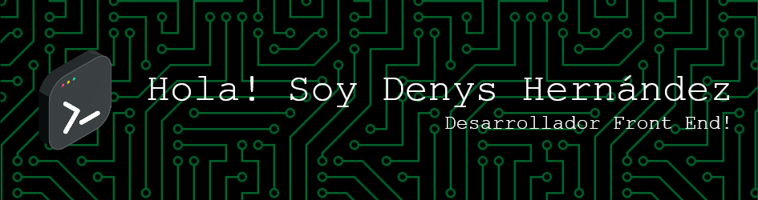

<h1 align="center">  <b align="center">Hola! Bienvenidos a mi perfil de GitHub</b>  </h1>

 

 

<h3 align="center">Soy un apasionado por la tecnologia estoy como pasante de QA en Tecnologias Informaticas Roots y me encanta tambien el desarrollo Front End</h3>

  

- 🔭 Actualmente estoy trabajando en [BlogdeCafe](blog-cafedenys.netlify.app)

- 🌱 Me encanta seguir aprendiendo **Estoy cursando un Bootcamp de Full Stack Jr**

- 👯 Otro pequeño proyecto [Tienda Virtual](tienda-proyecto-2.netlify.app)

- 🤝 Dando mis primeros pasos [freelancer](freelancer-codigodenys.netlify.app)

- 📫 Mi Contatcto **denisalexaner_96@hotmail.com**

<h2> 🌐 Contáctame: </h2>

<h2>Sistemas operativos 🐧:</h2>
 

Algunos de los sistemas que he utilizado y he trabajado son los siguiente:

  

  &nbsp;&nbsp;
  &nbsp;&nbsp;
  &nbsp;&nbsp;
  &nbsp;&nbsp;
  &nbsp;&nbsp;
  &nbsp;&nbsp;
  &nbsp;&nbsp;

<h3 align="left">Herramientas y Lenguajes utilizados:</h3>

               

## 📊 Estadísticas de GitHub:
 
 

## 🏆 Trofeos de GitHub

### 🔝 Repositorio con mayor contribución

---

<!-- Proudly created with GPRM ( https://gprm.itsvg.in ) -->

